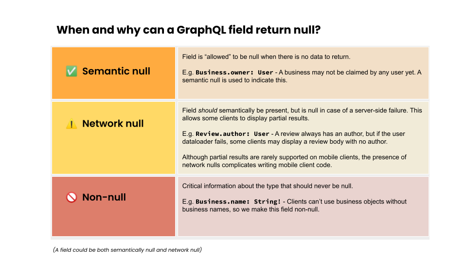

# ❓ Nullability

Fields are nullable by default in GraphQL. This was chosen so that a single
(versionless) schema [can evolve along with our models and data fetching, and
remain backwards compatible][use-gql-non-null] (remember that nullable ->
non-nullable is backwards compatible, except for input arguments).

The one exception is that fields with the ID type and fields related to
pagination _must_ be non-null to conform to the [Global Object Identification Specification][goid]
and [Cursor Connections Specification][connections-spec].

[use-gql-non-null]: https://medium.com/@calebmer/when-to-use-graphql-non-null-fields-4059337f6fc8
[goid]: https://graphql.org/learn/global-object-identification/
[connections-spec]: https://relay.dev/graphql/connections.htm

However, nullables complicate writing client code. For strongly typed clients
like the mobile platforms in particular, the client must explicitly handle the
null case in every situation it could conceivably appear, which can result in
enormous amounts of boilerplate. For this reason, we should be thoughtful about
making fields nullable.

It is also rarely the case that clients are set up to handle partial data. If you
want to provide partial data, make sure it's something the client can actually use.

If a field is non-nullable, then everything in that type will be null. For 
instance, if in the Business object, the name is non-nullable, but something goes
wrong and the name ends up being null anyway, the whole Business object will be
made null. If the Business object was nullable it stops there, otherwise
whatever object the Business object is in becomes null, and so on, walking up
the tree of types. The diagram below shows an example of how this works.

_To visualize the relationship between nullability and errors, try <https://apollo-visualizer.vercel.app/>_

## Summary


## An example - Why is this an issue?

```graphql
type Business {
  encid: String
  name: String
  promotion: Promotion
}

type Promotion {
  encid: String
  amount: Amount
  createdBy: String
}

type Amount {
  value: Int
  currencyCode: String
}
```

This schema may look fine, but would this corresponding response make any sense? Consider the checks the client would have to do to parse this data.

```json
business: {
  "encid": null,
  "name": null,
  "promotion": {
    "encid": null,
    "amount": {
      "value": null,
      "currencyCode": null,
    }
  }
}
```

Having said this, while making fields non-nullable can reduce complexity on the client, it reduces your ability to deal with partial results.
If a non-nullable field resolves to `null`, GraphQL will walk up the parent tree and serve `null` for the first nullable parent it finds:

```graphql
type Query {
  business: Business
}

type Business {
  name: String!
  location: Location!
  # etc
}
```

```json
# What the resolver returns
{
  "business": {
    "name": "Bobs Doughnuts",
    "location": null 
  }
}
# What is actually served to the client
{
  "business": null,
}
```

## Principles to keep in mind



- Handling partial data does require special code, which rarely exists on clients
  - It's often not straightforward to figure out what a screen should look like with arbitrary missing data.
  - Different data could hypothetically be missing in different circumstances, and each case would need to be supported.
  - It may not be worth the engineering effort to support partial data.

### Don't make scalar fields nullable if a null never makes sense for the field

- **Why?**

  It adds more work for client developers and doesn't communicate what data the schema is expected to provide.

- **Example**

  For many simple scalar fields, if the field is null, the type doesn't make much sense.

```graphql
  type Money {
    value: Int!
    currencyCode: String!
  }
```

_E.g. the `Money` type doesn't make sense if `value` or `currencyCode` are missing._

For other fields, a null value could become meaningful in the future even if it isn't now. If it seems plausible that
this might happen, it might make sense to make it non-nullable.

```graphql
type Business {
  location: Location
  # etc
}
```

For instance, suppose that now businesses must have a location. In the future, this could plausibly not be the case,
so this field is nullable.

_E.g. we could start supporting businesses without a fixed location._

### Use nullable fields more in larger, more widely used types

Generally, larger types that are used much more frequently should have more nullable fields, and smaller types used
less frequently should have more non-nullable fields.

- **Why?**

  - If a field on some type is non-nullable and its value ends up being null anyway, it makes the entire type null.
  - The more important and more widely used the type, the more important it is to not accidentally null out the type.
  - The more complex the type, the more likely you are to miss a case where some of it could plausibly be null.

- **Example**

  ```graphql
  type Business {
    headerPhoto: Photo!
    # etc
  }
  ```

  In this example, "headerPhoto" is non-nullable. If something goes wrong with "headerPhoto", the _entire_ business
  object will be null. This is a rather extreme reaction to an error. Also the Business object is important
  and widely used, so a problem with the Business object could make the app unusable.

  ```graphql
  type Photo {
    size: Size!
    url: Url!
    author: User!
    date: Date!
    ...
  }
  ```

  However, in this example, we can be a bit more aggressive, because if something goes wrong, we just wipe out one
  photo. Should we try and handle the size being null? Or the URL? Probably not. And if we expect to display a user,
  a date, etc, how should the UI change for each combination of missing fields? Is it worth supporting all these edge
  cases? Or just say we can't display the photo unless we have the key data we need?

### If you have a lot of semantic nulls, consider having different types to represent this data.

- **Why?**

If you are using nullables very frequently because you often expect fields to be null in normal circumstances, you
might want to have different types unified by a union or interface.

You can not only reduce the number of nulls, but allow the schema to more clearly self-document what data is
expected through more focused types.

- **Example**

  ```graphql
  type User {
    isElite: Boolean!
    yearsElite: [Year!]
    name: String!
    reviews: [Reviews!]!
  }
  ```

  You could have

  ```graphql
  interface User {
    name: String!
    reviews: [Reviews!]!
  }

  type NormalUser implements User {}

  type EliteUser implements User {
    yearsElite: [Year!]!
  }
  ```

Conceptually, there are different types of users here, which can be represented by having distinct types linked by an
interface. This makes it clear that only Elite users should have a list of years they have been elite, instead of
having a nullable field where it isn't clear when the field is or is not expected to be null.

## Advice by type

Once you've determined that it's appropriate for the parent type to have non-nullable fields, there are some general guidelines for specific types.

### Lists

Usually, lists should not be null. The contents of a list should not be null either.

- **Why?**

  - If you are making the contents of a list nullable, you are saying it is expected that the server will return
    a list that has some nulls in it. Would it be better to just filter out the nulls?
  - If you make the list nullable, is there ever a case you would want to send a null _instead of_ just sending an
    empty list? If not, don't make it null.

- **Example**

  Instead of

  ```graphql
  type Business {
    reviews: [Reviews]
    # etc
  }
  ```

  Prefer

  ```graphql
  type Business {
    reviews: [Reviews!]!
  }
  ```

  If there are no reviews, just return an empty list. And what would a "null" review signify?

### Booleans

Usually, booleans should not be nullable.

- **Why?**

  - Is the "null" state equivalent to True or False, and if so, why not just show that?
  - If it represents some sort of third state, should it be an enum instead?

- **Example**

```graphql
type Business {
  hasDelivery: Boolean!
  # etc
}
```

- If "hasDelivery" is null, what is the client supposed to do with that? Probably either the entire response should
  be an error, or the client should recover by assuming the business doesn't offer delivery.

- If there is any sort of limbo state between delivery and not-delivery, that could be expressed using an enum.

### Enums

Usually, enums should not be nullable.

- **Why?**

  If the enum could be null, what does the null state represent? Should that be another state in the enum?
  It probably would be more informative to have a state with a clear name replace "null".

- **Example**

Instead of this:

```graphql
type Business {
  reviewState: ReviewState
}

enum ReviewState {
  REVIEWED
  DRAFT
}
```

Or even this:

```graphql
type Business {
  reviewState: ReviewState
}

enum ReviewState {
  REVIEWED
  DRAFT
  NONE
}
```

Enum values that explain what a null _means_ can be more informative.

```graphql
type Business {
  reviewState: ReviewState!
}

enum ReviewState {
  REVIEWED
  DRAFT
  NONE
  ERROR
  NOT_APPLICABLE
}
```

### Strings

Unless you have a very unusual use case, always use nullables instead of empty strings.

- **Why?**

  Empty strings can lead to weird UI state. Nulls force the client to handle the case there is no data, but to the
  compiler an empty string looks no different than one with content.

- **Example**

  Instead of

  ```graphql
  type Photo {
     url: Url!
     author: User!
     caption: string!
     ...
  }
  ```

  Prefer

  ```graphql
  type Photo {
     url: Url!
     author: User!
     caption: string
     ...
  }
  ```

  - Otherwise, if the caption were the empty string, you might have a strange blank space where the caption should go.
