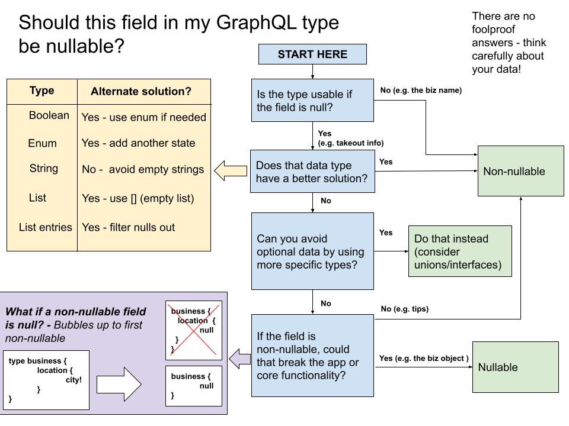

# :art: Schema Design

The GraphQL Schema is global to the whole of Yelp engineering. Ultimately, we
want to be able to model the whole of Yelp's user facing business data in
GraphQL. This page contains guidance on how we're thinking about this, in an
effort to present a clean, usable and scalable schema.

Before going any further, it's highly encouraged to skim over
[the official docs](https://graphql.org/learn/schema/) on this subject to
understand how the schema works.

::: warning Why do we care about this?
The schema (for now) is
[versionless](https://graphql.org/learn/best-practices/#versioning). Adding
bad types and making breaking changes can be costly, and best avoided.
Following this guide will help our schema stay in good shape!
:::

**Contents**
[[toc]]

## Types of types

In general, we have two types of _types_ at Yelp :) You should consider what
type of type you're adding:

1. **Core types**

   Things like `Business`, `User` etc. These are types that are common to many
   pages, teams or components at Yelp.

2. **Domain specific types**

   These are types that would only be used in one or a handful of
   components/teams. Examples would be `BusinessClaimability` or
   `EventsPageLeftRailAttendWidget`

Thinking about types in this way helps us communicate and establish ownership.
For example, this helps us decide:

- How much scrutiny should be applied in schema change code reviews
- What's the impact if a resolver starts consistently failing

Core types are the most widely used, and at the root of many queries.
As such, they generally have a higher bar for meeting our schema guidelines, and
any runtime issues should be triaged urgently.

## Keep the top level queries to a minimum

As much as possible, we want to model Yelp data as a tree, with Core Types as
the root nodes. Before adding a new top level query, consider if it makes more
sense to add it as an attribute of an existing type instead.

- **Why?**

  This helps keep our schema easier to read through at the top level, and aims
  to keep how the data is organized consistent.

- **Example**

  Instead of adding `canClaimBusiness` as a top level query under `root`, this
  can be an attribute (`claimability`) on the existing `Business` type.

## Be specific when naming types

Be specific with the naming of types. Namespace as much as possible (within
reason)!

- **Why?**

  It helps disambiguate what types are relevant to other types, and reduces
  naming collisions. (e.g. is `Price` the price range for a business? Or the
  ticket price for a Yelp event? Or something else?!)

- **Example**

  Prefer `BusinessCategory` instead of `Category`

## Don't namespace the fields

As an addendum to the above, _fields_ don't need to be overly specific/namespaced.

- **Why?**

  Fields are already implicitly namespaced by the _type_ that they're a field
  of. In other words, you always know what the parent type is in the context of
  a field name. (By contrast, a Type could be returned by anyone - you don't
  know what field name will return it.)

- **Example**

  Instead of

  ```graphql
  type BusinessAddress {
    """
    Formatted stringy version of address based on locale
    It reflects a new line using a new line character
    Example: 196 N Pleasant St\nAmherst, MA 01002
    """
    formattedBusinessAddress: String
  }
  ```

  Prefer:

  ```graphql
  type BusinessAddress {
    """
    Formatted stringy version of address based on locale
    It reflects a new line using a new line character
    Example: 196 N Pleasant St\nAmherst, MA 01002
    """
    formatted: String
  }
  ```

  _(An exception to this may be for fields on the root types (Query, Mutation, Subscription). Such "top level" fields are global, and probably still want to
  be namespaced.)_

## Describe the data, not the view

- **Why?**

  > _Make sure that your API isn't linked too closely with the demands of your initial
  > interface. If you're building an API for an iOS app, you might later port it to
  > other devices such as desktop computers or feature phones. When building queries,
  > focus on the underlying data, rather than how it's represented in your application._
  >
  > [https://www.graphql.com/articles/4-years-of-graphql-lee-byron](https://www.graphql.com/articles/4-years-of-graphql-lee-byron)

- **Example**

  Put in Yelpy terms; don't add a "UserProfileCard" type to return down the data
  to render a user's information in a Profile component.

  Instead, use the existing `User` type and return that to populate the Profile
  card component.

## Link via types, not IDs

When referencing one type from another, link directly to the type.

- **Why?**

  This allows developers greater flexibility when fetching data. If you only
  provide the ID of the thing you're linking to, that means the browser has to
  make a follow up query to fetch data about that entity.

- **Example**

  Instead of

  ```graphql
  type Review {
    """
    ID of the business that this review is about
    """
    businessId: Int
  }
  ```

  Prefer

  ```graphql
  type Review {
    """
    The business that this review is about
    """
    business: Business
  }
  ```

## Use existing standardized types and scalars

We have existing standardized types for representing:

- Photos
- Dates / Times

Use these when representing such information.

- **Why?**

  These types allow us to standardize how we model and consume common data types
  across the schema. This lets us avoid duplication of work and concepts.

- **Example**

  Instead of

  ```graphql
  type Review {
    """
    A photo that the user uploaded with this review
    """
    uploadedPhotoUrl: String

    """
    When was this review posted?
    """
    createdAt: String
  }
  ```

  Prefer

  ```graphql
  type Review {
    """
    A photo that the user uploaded with this review
    """
    uploadedPhoto: BusinessPhoto

    """
    When was this review posted?
    """
    createdAt: DateTime
  }
  ```

## Group related fields together

Err on the side of grouping related fields together under a new type. Don't be
afraid of adding nesting to the schema!

- **Why?**

  We want to reduce the bloat on our core types like `Business` and `User`. We
  prefer to keep the number of fields on core types to a minimum, to aid the
  discoverability of existing related fields by subgrouping them under a
  common prefix. (Imagine scrolling through the docs sidebar over
  _hundreds_ of fields in GraphiQL!)

  In turn, better discoverability can help us avoid accidentally adding
  duplicate fields elsewhere in the schema.

  If you are starting off with a new type and aren't sure whether it needs to
  be subgrouped yet or not, consider [the rule of three][rule-of-three]. It's
  OK to add it directly to the type to _start_ with - and if you find yourself
  needing to add other related types in the future, deprecate it and migrate
  over to this new pattern.

  [rule-of-three]: https://en.wikipedia.org/wiki/Rule_of_three_(computer_programming)

- **Example**

  Instead of

  ```graphql
  extend type Business {
    """
    Is this business an advertiser with us?
    """
    isAdvertiser: Boolean

    """
    How many times have users clicked this business's advertisement
    """
    adClicks: Number

    """
    Amount of estimated revenue the business has earned from a campaign
    """
    revenueFromCampaign: Number

    """
    Search keywords that we should ads for this business on
    """
    adKeywords: [String]
  }
  ```

  Prefer

  ```graphql
  type BusinessAdvertising {
    """
    Is this business an advertiser with us?
    """
    isAdvertiser: Boolean

    """
    How many times have users clicked this business's advertisement
    """
    clicks: Number

    """
    Amount of estimated revenue the business has earned from a campaign
    """
    revenueFromCampaign: Number

    """
    Search keywords that we should ads for this business on
    """
    keywords: [String]
  }

  extend type Business {
    """
    Information related to our Business Advertising product
    """
    advertising: BusinessAdvertising
  }
  ```

  This can (and should!) be broken up even further with time, should the types
  grow even more.

- **Prior art**

  - ["Group closely-related fields together into subobjects"](https://github.com/Shopify/graphql-design-tutorial/blob/master/TUTORIAL.md#rules-and-subobjects)
  - ["Prefer Object Types over simpler structures"](https://www.apollographql.com/blog/graphql-schema-design-building-evolvable-schemas-1501f3c59ed5)

## Use triple quotes for descriptions

When adding descriptions to fields, use triple quotes (`"""`). Don't use `#`.

- **Why?**

  There are two ways of adding comments in GraphQL - triple quotes
  (`"""like this"""`) and hashtags (`# like this`). [They are syntactically
  different however.](https://github.com/graphql/graphql-spec/issues/420#issuecomment-371279317)

  `"""this is a description"""` are _descriptions_, and should be used
  to document fields and types.

  `# this is a comment` syntax is ignored by the parser and should not
  be used for schema documentation.

- **Example**

  Instead of

  ```graphql
  extend type Business {
    # The name of the business (e.g. "The French Laundry")
    name: String
  }
  ```

  Prefer

  ```graphql
  extend type Business {
    """
    The name of the business (e.g. "The French Laundry")
    """
    name: String
  }
  ```

## Space out field descriptions

When adding multiple fields and descriptions, space them out! (i.e. newlines
between stanzas)

- **Why?**

  Readability!

- **Example**

  Instead of

  ```graphql
  type YelpProsEntryPointBanner {
    "Yelp Pros logo image url"
    logoUrl: String
    "Part of the heading for the banner - starting part"
    headingStart: String
    "Part of the heading for the banner - ending part"
    headingEnd: String
    "Sub heading of the banner"
    subHeading: String
  }
  ```

  Prefer

  ```graphql
  type YelpProsEntryPointBanner @owners(teams: "services-marketplace") {
    """
    Yelp Pros logo image url
    """
    logoUrl: String

    """
    Part of the heading for the banner - starting part
    """
    headingStart: String

    """
    Part of the heading for the banner - ending part
    """
    headingEnd: String

    """
    Sub heading of the banner
    """
    subHeading: String
  }
  ```

## Be super explicit with comments and descriptions

Provide as much context as you can about type, field, parameter etc you’re
adding. Describe concepts [from first principles][first-principles] where
applicable.

[first-principles]: https://fs.blog/2018/04/first-principles

Some examples of things to think about:

- Clear description of _what_ the thing being added is
- Avoid any team-specific acronyms
- Describe all enum values so we know what the different options represent
- Permalink to sources of truth that define or document the data/concept

Pretend a newhire is reading the schema, and the only context they have is just
what you wrote. Do they have enough information to know how to use it, given
your comments alone?

- **Why?**

  Don’t assume everyone at Yelp wanting to use the fancy new schema you just
  wrote has the same knowledge you have! Put yourself in the shoes of a newhire
  at Yelp - you’d want as much context as possible in order to understand
  what the schema is representing, in order to be able to use it :)

- **Example**

  Instead of

  ```graphql
  extend type Business {
    # Return a list of Yelfies, given a yelfieType
    getYelfies(
      # yelfie type
      yelfieType: String!
    ): [Yelfie]
  }
  ```

  Prefer

  ```graphql
  extend type Business {
    """
    Return a list of Yelfies.

    A Yelfie is a user photo taken at a business, with some special filters
    applied. See y/yelfies for more info about this feature.
    """
    getYelfies(
      """
      Provide the type of Yelfie to filter for.
      e.g. “smilingFace”, “eatingFood”

      The yelfieTypes are defined in the yelfie.json config file - see y/yelfie-type-docs
      """
      yelfieType: String!
    ): [Yelfie]
  }
  ```

When modelling complex business objects, usually just a brief summary and a link
to find more will suffice.

## Use nullable for most object fields by default, but there are many exceptions

_Refer to [Nullability](nullability.md) for detailed recommendations._


